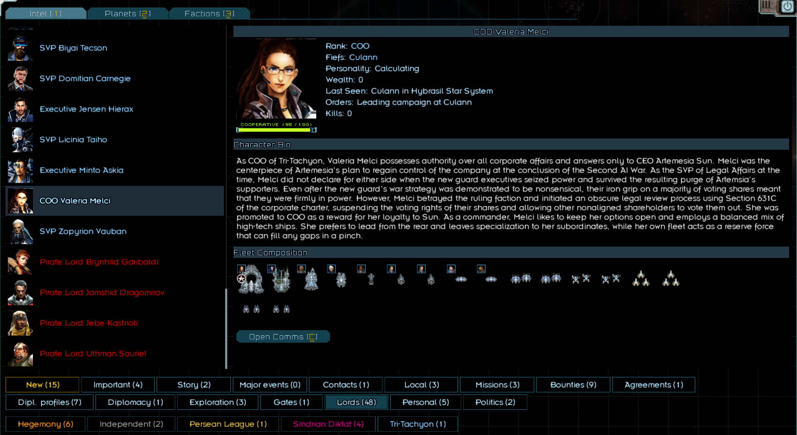
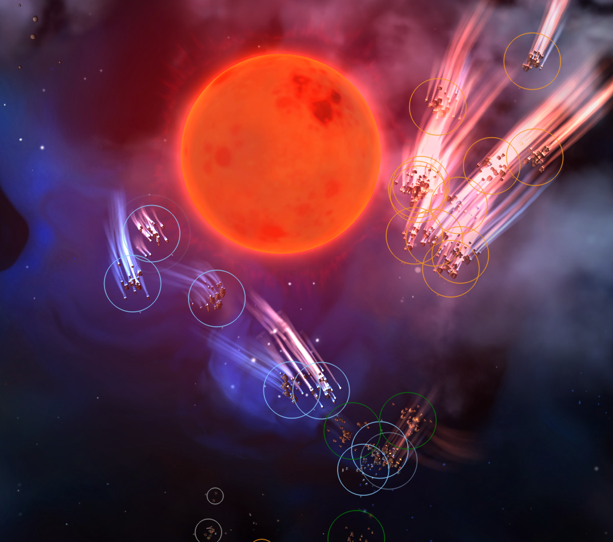
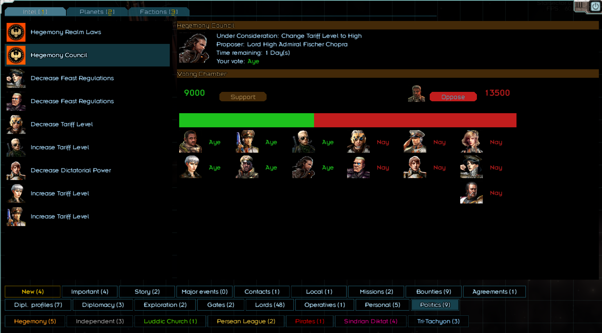

# Star Lords

Star Lords attempts to bring the world of [Starsector](https://fractalsoftworks.com/) to life with many character-centric features. No longer will your only allies be nameless faction fleets who you'll meet once and never again. The core mechanic is the addition of dozens of Lords to the game, each with their own personality, fleet composition, backstory, and agendas.

Lords will roam the map alongside the player-- raiding, trading, feasting, expanding, and more. Lords follow their own economic system, requiring them to physically visit their fiefs to levy taxes and purchase new ships. They operate persistently and without requiring any interference from the player. When the Marshal raises the banners, the Lords will muster to war in organized interplanetary campaigns of unprecedented scale.

A Lord's behavior is heavily dependent on their personality and interpersonal relations with other Lords. Inter-lord relations are fully modeled, culminating in a brand new political system where Lords will politick, scheme, form alliances, and backstab while jockeying for wealth and influence within the realm.

Curry favor with Lords by completing their quests, fighting alongside them in battle, or supporting their political agenda. Form a core of close allies and leverage their support to seize de-facto power in your faction's political system. Or convince them to join your own faction and support your claim to unite the sector.

Star Lords is heavily inspired by campaign mechanics of Mount and Blade. The goal is to eventually add all major campaign mechanics from Warband. This mod aims to have minimal side-effects on the game. There are no changes to in-battle gameplay, and no direct effects on campaign balance aside from the actions of the Lords themselves.

### Disclaimer
This mod is currently in early development. Expect plenty of bugs, crashes, questionable balancing, etc. Please report any crash logs or balance feedback to the forums. Thank you for your cooperation.

### Installation
Download the latest release [here](https://github.com/Deluth-git/Starlords/releases) and unzip in your Starsector mod folder.

This mod may be added to existing savegames, but may not be removed after being added. Make sure to back up your save game first in case of unexpected issues.

### Full Feature List
* Adds __48 unique Lords__ spread among all the base major factions.
* Adds fief system, where each market is a fiefdom which can be owned by a Lord. 
* Custom __Economic system__ for Lords
  * Lords collect taxes from their own fiefs and participate in business ventures in friendly markets. 
  * Income is used to expand their fleet, hire marines, and maintain existing ships.
* Custom fleet constructor for Lords, which allows each Lord to have their own __distinctive fleet composition__.
* Lords are __active on the map__, collecting income and waging war.
  * Lord actions are heavily dependent on Lord's personality and relations with other Lords
  * Lord's officer corps slowly level up from fighting in battles
* __Player-Lord Interactions__- If a Lord trusts you sufficiently, they may follow the player's military orders, offer quests, participate in scheming, and share sensitive intel about their operations.
* __Feast system__- Take a reprieve from braving the sector and join the lords of the realm in a night of feasting and revelry. Feasts are an excellent chance to meet all the lords and build rapport with them.
* __Campaign system__- Campaigns may be started by a faction's appointed marshal. All lords of the realm will gather to launch a grand invasion into enemy territory or defend against an enemy's invasion. If Nexerelin is enabled, lords may also use the Nexerelin ground combat system to capture markets.
* __Defection system__- Lords who are dissatisfied with their faction may defect to another. Or you can speed along the process and persuade or bribe Lords to join your own faction as your subordinates.
* __Prisoner system__- Lords may be captured in battle and either ransomed for credits or released for future goodwill.
* __Political system__- The cornerstone of all lord relations, the new political system is where all Lords of the realm gather to propose and vote on legislation. Appoint new marshals, squabble for newly conquered fiefs, conduct foreign policy, and more, as long as you can control the political situation.

### Major Planned Features
Most of these are inspired by Mount & Blade.
* Continued Lord AI improvement and optimization.
* Political marriage/courtship system for forming marriage alliances.
* Expanded subterfuge system involving scheming with friendly lords to increase your status in the realm or discredit mutual rivals.
* "Freelancer" system for enlisting in a Lord's army and fighting as a common pilot.
* Flesh out feast system, with feast tournaments as friendly competition with fellow Lords
* Better integration with Nexerelin invasions and base game crises.
*  Custom questlines for certain lords, e.g. allowing AI-sympathizing lords to field [REDACTED] fleets.

### Dependencies/Compatibility
This mod has no dependencies, though it's recommended to play with [Nexerelin](https://github.com/Histidine91/Nexerelin/tree/master) for planet capture mechanics. This mod should work with faction/ship/weapon mods which don't impact base campaign mechanics. Any kind of mod that only affects in-battle gameplay is also fine. All specific compatibilities are not yet tested.

### Adding your own Lords
If you're a modder or just want to put your own characters into the game, all you have to do is add another entry to the [lords.json](https://github.com/Deluth-git/Starlords/blob/master/data/lords/lords.json) file. A few notes:
* "portrait" should be a valid image. By default, the mod will check for .PNGs in `data/graphics/portraits/` of the base game or any mod folder. If your portraits are located in an unusual location, you can specify the path directly e.g. `graphics/my_folder/my_portraits/my_portrait.png`. This portrait must also be registered in any faction config in `data/world/factions`. You may register it under the `starlords_nobility` faction if you want a lord-exclusive portrait.
* "faction" should be a valid [faction id](https://fractalsoftworks.com/starfarer.api/constant-values.html#com.fs.starfarer.api.impl.campaign.ids.Factions.DIKTAT)
* "fief" should be a valid market id or null
* "ranking" is the lord's rank, which affects their political weight and base income. It should be between 0 and 2, where 2 is highest.
* "customSkills" adds a valid skill to the lord upon generation, which can be used to give specific fleet or piloting modifiers to the character. Each skill must have a value correlated to its level e.g. "field_modulation": 2 for elite-level field modulation on creation
* "customFleetSMods" sets which custom hullmods should be built into the Lord's fleet. Any number can be selected. The value of each hullmod indicates the odds of the hullmod being selected when applying a smod to a given ship. default value is 100. 
* "customLordSMods" sets which custom hullmods should be built into the Lord's flagship. Any number can be selected. The value of each hullmod indicates the odds of the hullmod being selected when applying a smod to the flagship. default value is 100. 
* "fleetForceCustomSMods" set this as false to allow the 'customFleetSMods' to be used alongside the normally selected SMods. if set to true, or unset, a given ship will attempt to add every hullmod in 'customFleetSMods' first
* "flagshipForceCustomSMods"  set this as false to allow the 'customLordSMods' to be used alongside the normally selected SMods. if set to true, or unset, the flahship will attempt to add every hullmod in 'customLordSMods' first
* "preferredItem" can be any of `domestic_goods`, `food`, `luxury_goods`, `drugs`, `hand_weapons`, `alpha_core`, or `lobster`.
* "executiveOfficers" for custom second in command officer layouts. It is a json object where the id is the officer's aptitude, and the value a list of his chosen skills. Skills will continue to be added at random until the executive officers are fully leveled up if they are not specified. 
* "dialogOverride" for custom lord dialogs. Is is a json array were the id is the dialog id (matched to the id of a object in the dialog.json). will attempt to run said Dialogs, but will also run the normal dialogs if the line it is looking for does not exsist in the inputed Dialogs (or if the lord fails to meet the requirements for the wanted line)
* Flagship and ship preferences must contain valid ship variant ids. You can find these under the `/data/variants` folder of `starsector-core` or any mod directories.
* Faction and fief will be automatically converted to lower case. Ship variants are case-sensitive.

After that, your lord should be created automatically upon starting a new game.

### Adding Custom SMods to lords
If you're a modder, or just someone who likes S-Mods you might want to expand on the number of S-Mods are available in the generic starlords S-Mod pool. All you have to do is add another entry to the [SMods.json](https://github.com/Deluth-git/Starlords/blob/master/data/lords/SMods.json) file. A few notes:
* "rules" is each requirement that must be met before this set of S-Mods can be added to a given ships pull. every condition must be met for this to happen. conditions are as follows:
  * "hullmods" is the hullmods this set of Smods requires to meet requirements. Set to true for whitelist, and false to blacklist. To meet requirements, a ship must have at least one 'true' hullmod (if any are created in this rule), and no 'false' hullmods
  * "manufacture" is the manufactures this set requires to meet requirements. set to true for whitelist, and false for blacklist. To meet requirements, a ship must have a manufacture of one of the 'true'  manufacture (if any are created in this rule), and must not have a manufacture of the 'false' manufactures.
  * "lordTags" is the starlord tags this set requires to meet requirements. set to true for whitelist, and false for blacklist. To meet requirements, a lord must have a tag of one of the 'true' tag (if any are created in this rule), and must not have a tag of the 'false' tags.
  * "system" is the shipSystem this set requires to meet requirements. set to true for whitelist, and false for blacklist. To meet requirements, a ship must have a system of one of the 'true' systems (if any are created in this rule), and must not have a system of the 'false' systems.
  * "startingFaction" is the starting faction required to meet requirements. starting faction is the faction a lord was part of when they first spawned. set to true for whitelist, and false for blacklist. To meet requirements, a lord must have a starting faction of one of the 'true' factions (if any are created in this rule), and must not have a stating faction of the 'false' factions.
  * "currentFaction" is the current faction required to meet requirements. set to true for whitelist, and false for blacklist. To meet requirements, a lord must have a current faction of one of the 'true' factions (if any are created in this rule), and must not have a current faction of the 'false' factions.
  * "hullID" is the hull required to meet requirements. set to true for whitelist, and false for blacklist. To meet requirements, a ship must have a hull id of one of the 'true' hulls (if any are created in this rule), and must not have a hull id of the 'false' hulls.
  * "defenseType" is the defense type this set requires to meet requirements. set 'true' to all defense types you want this modification to effect. 
    * "NONE"
    * "PHASE"
    * "FRONT"
    * "OMNI" 
  * "fighterBays" is the number of fighter bays this set requires to meet requirements. set between a "min" and "max" value. to get all ships with fighter bays, set "min" to one. to get all ships without figher bays, set "max" to 0
  * "size" is the size this set requires to meet requirements. options are:
    * "FRIGATE"
    * "DESTROYER" 
    * "CRUISER"
    * "CAPITAL_SHIP"
* "S-Mods" are the S-Mods that you want to have present when the groups rules are met. so mods must contain a hull mod ID, and a integer. this value is the amount of weight the Smod has in the pull. default value should be 100

### Adding Custom dialog to lords
If you're a modder, or just someone who loves to write dialog for every starlord in your lords.json, you might want to create custom dialog lines with custom conditions for your starlords. All you have to do is add another entry to the [dialog.json](https://github.com/Deluth-git/Starlords/blob/master/data/lords/dialog.json) file. A few notes:
* the dialog.json is made out of 'dialogs'. each 'dialog' has a "priority", "rules", and "lines" inputs.
  * "priority": is a integer. it is the order that the game will attempt to grab a line from dialog (provided that the line exists in a dialogSet in this dialog). if set to 0, only a lords "dialogOverride" data can be used to grab this dialog. (with the exseption of the "default" dialog, wish is used as a backup.)
  * "rules": is a jsonObject. the 'rules' contents can be seen below. all 'rules' must meet requirements on a starlord to function.
  * "lines": is a list of dialog sets. each dialog set can have their own priority, lines, and rules. 
* each "dialog" contains a list of "dialog sets". if the "dialogs" rules are true, the game will attempt to get the highest priority dialogset that is true withen it.
* "priority" is the priority of this dialog. should have a value of at least 0 the dialog with the highest priority that has all its "rule" reuqirements met will be used in any instance, unless the lord you are talking to has a at least one valid "dialogOverride"
* "rules" is each requirement that must be met for a set of dialog to be used by a given starlord. every condition must be met for this to happen. conditions are as follows:
  * target rules: all 'target' rules contain the 'rules' json object. and instead of runing the rules onto the interacting lord, they run the rules for whatever lord they interact with instead. --will return false if whatever lord the rule wants cannot be found-- 
    * "SECOND_LORD" : 'target lord'. 
    * "SECOND_LORD_SPOUSE" : 'target lords' spouse.
    * "PLAYER_SPOUSE" : playes spouse
    * "LORD_SPOUSE" : interacting lords spouse
    * "LORD_HOST" : whoever is hosting the feast the lord is currently at. 
    * "LORD_HOST_SPOUSE" : the spouse of whoever is hosting the fleet the lord is currently at
    * "WEDDING_TARGET" : whoever is getting married at this feast
    * "WEDDING_TARGET_SPOUSE" : whoever is getting married at this feasts spouse
  * condition rules: are things that can contain rules objects but run diffrent operaters on said objected.
    * "or" contains a jsonArray, were each item in the array is a 'rules' jsonObject. if any of the contained 'rules' jsonObjects have all there rules return true, this condition returns true.
  * value rules. value conditions can contain the following data:
    * Integer: the value that the item must have to meet requirements.
    * dialogValue: a dialog value json object. the return value of the dialog value is what the item must have to meet requirements.
    * {"min","max"}: were "min" and "max" can be a Integer, or a dialogValue. the item must be between min and max to meet requirements. min and max have a default value of -infinity and +infinity respectively.
    * "relationWithPlayer" is the relationship that this lord has with the player.
    * "playerWealth": is the number of credits the player has.
    * "lordWealth": is the number of credits the lord has.
    * "playerLevel": is the level the player is.
    * "lordLevel": is the level the lord is.
    * "playerRank": is the rank of the player in there faction.
    * "lordRank": is the rank of the lor din there faction.
    * "lordsCourted": is the number of lords the player has professed admiration to.
    * "playerLordRomanceAction":  is the number of romantic actions the player and lord have had together <3.
    * "lordsInFeast": will return false if: not at a feast. is the number of lords at the current feast.
    * "optionOfCurrProposal": will return false if: the lords faction is not currently voting on a proposal. is the opinion of the current proposal the lord has.
    * "optionOfPlayerProposal": will return false if: the player has no active proposal. is the opinion of the player proposal the lord has. 
    * "lordProposalSupporters": will return false if: lord does not have a proposal active. is the number of supports the lords proposal has.
    * "lordProposalOpposers": always returns false if: lord does not have a proposal active. is the number of opposers the lords proposal has. 
    * "playerProposalSupporters": always returns false if: player does not have a proposal active. is the number of supports the players proposal has.
    * "playerProposalOpposers": always returns false if: player does not have a proposal active. is the number of opposers the players proposal has.
    * "curProposalSupporters": always returns false if: there is no active proposal in the lords faction counsel. is the number of supports the lords factions current proposal has 
    * "curProposalOpposers": always returns false if: there is no active proposal in the lords faction counsel. is the number of supports the lord factions current proposal has 
    * "lordLoyalty": is the relationship this lord has with there faction.
    * "playerHasCommodity": is a jsonObject containing a set of commodityID's : value condition. the player must meet the requirements of every commodity.
    * "validLordNumbers": this is a jsonArray with 3 parts: "min", "max", "rules". what this does is it looks at all starlords in the game, and the number of lords that meet all "rule" requirements must be between the "min" and "max" values.
    * "baseValue": {"value":intiger || dialogValue, "min":intiger || dialogValue, "max":intiger || dialogValue}. this does not have a base value, instead has an inputted value. useful when compairing dialogValues without having to set them into memory first.
  * boolean rules. each data here must be set to true or false. if set to true, the item must also be true. if set to false, the item must also be false.
    * "isMarriedToPlayer": if the lord is married to the player 
    * "isMarried": if the lord is married to anyone
    * "isPlayerMarried": if the player is married to anyone.
    * "willEngage":if the lord is willing to attack the player
    * "hostileFaction": if the faction the lord is part of is hostile to the faction the player is a part of.
    * "isAtFeast": if the lord is at a feast.
    * "isHostingFeast": will return false if the lord is not at a feast. is if the lord is hosting the feast they are at.
    * "playerSubject" if the lord is part of the player faction.
    * "playerFactionMarital" will return false if the player and lord are not in the same faction. is if the player is the faction marital or not.
    * "lordFactionMarital" will return false if the player and lord are not in the same faction. is if the lord is the faction marital or not. 
    * "lordAndPlayerSameFaction" if the lord and player are start of the same faction. 
    * "isLordCourtedByPlayer": is if the player is corting the lord. 
    * "availableTournament" : will return false if not at a feast. is if the feasts tournament has not yet happened. 
    * "playerTournamentVictory": will return false if not at a feast. is if the player has won the tournament at the current feast.
    * "lordTournamentVictory": will return false if not at a feast. is if the player has won the tournament at the current feast.
    * "playerTournamentVictoryDedicated": will return false if: not at a feast, or the player has not won the tournament there. is if the player has already dedicated there victory at the tournament.
    * "tournamentDedicatedToLord": will return false if not at a feast. is if the lord is the one this tournament is dedicated to.
    * "feastIsHostingWedding": will return false if not at a feast. is if this feast is hosting a wedding.
    * "isWeddingTarget": will reutrn false if not at a feast, or the feast is not hosting a wedding. is if the lord is the wedding target or not. 
    * "firstMeeting": is if this is your first time talking to this starlord or not. 
    * "hasProfessedAdmirationThisFeast": will return false if: not at a feast. is if the player has professed admiration this feast. 
    * "hasHeldDateThisFeast": will return false if: not at a feast. is if the player has been on a date yet this feast. 
    * "lordPledgedSupport_forActiveProposal": will return false if the lords faction is not voting on anything. is if the lord has pledged support for active proposal or not. 
    * "lordPledgedSupport_againstActiveProposal": will return false if the lords faction is not voting on anything. is if the lord has pledged opposition for the active proposal or not. 
    * "lordPledgedSupport_forPlayerProposal":  will return false if the player has no proposal. is if the lord has pledged support for the players proposal or not. 
    * "lordPledgedSupport_againstPlayerProposal": will return false if the has no proposal. is if the lord has pledged against the players proposal or not. 
    * "playerProposalExists": if the player has a active proposal. 
    * "lordProposalExists": if the lord has a active proposal. 
    * "lordFactionHasActiveConsole": if the lords faction is voting on a proposal or not. 
    * "playerFactionHasActiveConsole": if the players faction is voting on a proposal or not.
    * "lordActingInPlayerFleet": if the lord is in the player fleet or not. 
    * "isSwayed": if the player has attempted to sway the lord to support / oppose a proposal. 
    * "lordProposalPlayerSupports": if the lord is supporting the players proposal or not 
    * "playerProposalLordSupports": if the lord is supporting the players proposal or not 
    * "curProposalPlayerSupports": if the player is supporting the currently active proposal or not
    * "curProposalLordSupports": if the lord is supporting the currently active proposal or not
    * "lordFleetIsAlive": if the lords fleet is alive or not. 
    * "lordHasLiege": if the lord has a liege or not (some factions don't have lieges.)
    * "playerHasLiege": if the lord has a liege or not (some factions don't have lieges.)
    * "isPersonalityKnown": if the player knows the lords personality yet. 
  * whitelist / blacklist rules. each rule here contains a jsonObject, were a item ID is what its looking at, and its boolean value is wether or not the item is whitelisted or blacklisted. all blacklisted items must not be present, and at least 1 (if present) whitelisted item must be present
    * "startingFaction" is the starting faction the lord has.
    * "currentFaction" is the current faction the lord is in.
    * "lordsFavItem": is the lord fav item
    * "LordTags": is the tags that need to be attached to the lord person
  * "lordPersonality": is the lord personality type this rule requires to meet requirements. set 'true' to all lord personality types you want to be allowed to meet requirements.
    * "Upstanding"
    * "Martial"
    * "Calculating"
    * "Quarrelsome"
  * "lordBattlerPersonality": is the lord personality type this rule requires to meet requirements. set 'true' to all lord personality types you want to be allowed to meet requirements.
    * "Reckless"
    * "Aggressive"
    * "Steady"
    * "Cautious"
    * "Timid"
  * "random": returns true if a random number (called 'range') is less then the base value.
    * "range": Integer || dialogValue. this is the range the random number will have
    * "value": Integer || dialogValue. this is the base value
  * "getDialogData": jsonObject gets a list of 'dialog data". for each different type of data, the requirements are different.
    * "dataID" : jsonObject. is the string data required to meet requirements. set to true for strings you require this memory to be, and false for strings this memory must be. To meet requirements, the string must match all of the 'true' strings, and not match any of the 'false' strings. if a string of the dataID does not exist, treats the string as though it is ""
    * "dataID" : jsonObject. {"min","max"} is the value rules required to meet requirements.
    * "dataID" : boolean.  is the boolean value of this data required to meet requirements. if set to true, the boolean must also be true. if set to false, the boolean data must also be false. if a boolean of the dataID does not exist, treats the boolean as though it is false.
  * "getMemoryData": jsonObject gets a list of 'game memory data;. for each different type of data, the requirements are different. (keep in mind: this can get any data in starsectors memory. data ID must start with '$' or it might break something)
    * "dataID" : jsonObject. is the string data required to meet requirements. set to true for strings you require this memory to be, and false for strings this memory must be. To meet requirements, the string must match all of the 'true' strings, and not match any of the 'false' strings. if a string of the dataID does not exist, treats the string as though it is ""
    * "dataID" : jsonObject. {"min","max"} is the value rules required to meet requirements.
    * "dataID" : boolean.  is the boolean value of this data required to meet requirements. if set to true, the boolean must also be true. if set to false, the boolean data must also be false. if a boolean of the dataID does not exist, treats the boolean as though it is false.
  * "getLordMemoryData": jsonObject gets a list of 'lord memory data". for each different type of data, the requirements are different.
    * "dataID" : jsonObject. is the string data required to meet requirements. set to true for strings you require this memory to be, and false for strings this memory must be. To meet requirements, the string must match all of the 'true' strings, and not match any of the 'false' strings. if a string of the dataID does not exist, treats the string as though it is ""
    * "dataID" : jsonObject. {"min","max"} is the value rules required to meet requirements.
    * "dataID" : boolean.  is the boolean value of this data required to meet requirements. if set to true, the boolean must also be true. if set to false, the boolean data must also be false. if a boolean of the dataID does not exist, treats the boolean as though it is false.
  * the following options only work if used in an option called by advanced option data, or if used in the "validLordNumbers" rule.
    * "relationsBetweenLords": is the relationship range that this lord must have with the target lord to meet requirements. set between a "min" and "max" value. range must be between -100 and 100.
    * "lordAndTargetSameFaction": if set to false, the lord and target must not be part of the same faction to meet requirements. if set to ture, the lord and target must be part of the same faction to meet requirements.
    * "isInteractingLord": if set to false, the lord and target must not be the same to meet requirements. if set to true, the lord and target must be the same to meet requirements.
* basic is simply a "lineID": "new string";
  * advanced is more complicated. its a json object, that must include a "line" (to act as the normal lineID), but also additional json peramiters. "addons" are . the "addons" are as follows:
    * "addons" additional conditions and effects that you can have run at the moment this line is ran. most 'addons' also add a line of dialog to show what effects they had. any "option_" will only run addons after the option is selected. and "tooltip_" line cannot use "addons"
      * targets:
        * "targetLord" does nothing if: target lord is unset. runs the contained 'addon' json object, for the target lord instead of the interacting lord
      * value changes: value changes can contain the following data:
        * Integer: the value that will be added / removed from a given stat. if min and max are both set, the value will be a random number between the 2.
        * dialogValue: a dialog value json object. the return value of the dialog value is what the item must have to meet requirements.
        * {"min","max"}: were "min" and "max" can be a Integer, or a dialogValue. 
        * "repChange" changes the relation between the lord and player
        * "creditsChange" changes the amount of credits the player has.
        * "exchangeCreditsWithLord" gives / takes credits from a lord. a negative value gives, a positive value takes.
        * "romanceChange" changes the stored romance value between the lord and player.
        * "changeCommoditysInPlayersFleet" holds a jsonObject of commoditys, were the value is how mush this commoidity changes. the value follows the same rules as any other value addon.
      * "additionalText": "lineID" adds an additional line of dialog, with the inputed name. also take a jsonArray as input, running each inputed line in sequence.
      * "wedPlayerToLord": boolean. if set to true, marry's the lord and player. if set to false, and the player and lord are married, un-marry's the lord and player.
      * "wedPlayerToWeddingTarget": boolean. if set to true, marry's the wedding target and player. if set to false, and the player and wedding target are married, un-marry's the wedding target and player.
      * "startWedding": boolean. if set to true, sets the current feast the player is at to a wedding ceremony (or howeer that works). will do nothing if not at a feast.
      * "dedicateTournamentVictoryToLord": boolean. if set to true, dedicates your tournament victory to the target lord. only runs if you are at a feast, and won the tournament.
      * "startTournament": boolean. if set to true, starts a Tournament. 
      * "defectLordToFaction": String || {"factionID" String, "newRank":Intiger || dialogValue, "includeFiefs": Boolean}. causes the lord to defect to the target faction. can optionaly set the lords rank, or if they take there fiefs with them. default is rank 0, and will take fiefs with them. (although some factions cannot have fiefs taken in defection.)
        * if you want the lord to defect to the players current faction, set the base String, of factionID to "playerCurrFaction".
      * "playSound": String || {"soundID":String, "pitch":Integer || dialogValue, "volume": Integer || dialogValue}. runs Global.getSoundPlayer().playUISound on the inputed data.
      * "attemptToAddRandomQuest": boolean. if set to true, it will run ether the '' line, or the '' line. depending on if a quest can actually get gotten or not. please note: this is to be removed, and replaced with a more complicated quest system in the future.
      * "setHeldDate": boolean. sets if you have held a data this feast.
      * "setProfessedAdmiration": boolean. sets if you have held professed admiration this feast.
      * "setCourted" : boolean. sets whether you are courting this lord. setting this to true lets you do romance =)
      * "setInPlayerFleet": boolean. sets whether this lord is in the player fleet, or in their own fleet.
      * "setPledgedFor_CurrentProposal": boolean. sets whether the lord you are talking to has pledged support for the current proposal or not.
      * "setPledgedAgainst_CurrentProposal": boolean. sets whether the lord you are talking to has pledged opposition for the current proposal or not.
      * "setPledgedFor_PlayerProposal": boolean. sets whether the lord you are talking to has pledged support for the player proposal or not. 
      * "setPledgedAgainst_PlayerProposal": boolean. sets whether the lord you are talking to has pledged support for the player proposal or not.
      * "setPlayerSupportForLordProposal": boolean. sets weather the player is currently supporting the lords proposal, or is opposed to the lords proposal.
      * "setPlayerSupportForCurProposal": boolean. sets weather the player is currently supporting the current proposal or is opposed to the current proposal.
      * "setSwayed": boolean. sets whether the lord you are talking to has been swayed or not. if so, they cannot be swayed until the next proposal.
      * "setPersonalityKnown": boolean. sets weather the player knows this lords personality.
      * "setLordRank": Intiger || dialogValue. sets the lords rank.
      * "setPlayerRank": Intiger || dialogValue. sets the players rank.
      * "setDialogData": jsonObject. sets data that is stored in the dialog, and is deleted when the interaction ends. if a jsonObject with a min/max is one of its lines, it acts as a increase to the value.
        * each line is "dataID" : String || boolean || integer/dialogValue || JsonObject {min: integer/dialogValue,max: integer/dialogValue}
      * "setMemoryData": jsonObject. sets memory key data. memory is held in the save file, and will remain forever. please keep in mind, chose your memorys dataID wisely. your dataID must start with '$', and should not be the same as ANY OTHER MEMEORY IN THE GAME. be carefull. if a jsonObject with a min/max is one of its lines, it acts as a increase to the value.
        * each line is "dataID" : String || boolean || integer/dialogValue || JsonObject {min: integer/dialogValue,max: integer/dialogValue}
      * "setLordMemoryData": jsonObject. sets memory key data, linked to the interacted starlord. memory is held in the save file, and will remain forever, or until the starlord dies. each starlords memory is stored in "$STARLORDS_LORD_ADDITIONAL_MEMORY_%lordID". (were lordID is the ID tied to the lord). so try not to grab that directly please. if a jsonObject with a min/max is one of its lines, it acts as a increase to the value.
        * each line is "dataID" : String || boolean || integer/dialogValue || JsonObject {min: integer/dialogValue,max: integer/dialogValue}
      * "setLordTags": jsonObject. were each item is 'tagName' : boolean. set to true to add a tag, false to remove it. tags will remain on a starlord until removed.
    * "color" color override for this dialog line. not required. has 3 'preset' colors, but also the option for a custom color. cannot be used in any "tooltip_" line.
      * "RED"
      * "GREEN"
      * "YELLOW"
      * "ORANGE"
      * optional array is as follows: (with a default value of 0 for r,b,g, and a default value of 255 for a.)
      * "r"
      * "g"
      * "b"
      * "a"
    * "highlight":jsonObject {"highlight":String||JsonArray, "color":color object (see "color addon") } highligts a string or multible strings on the same line with the inputed color. does not work if this line is called as a option.
    * "options" is an jsonArray containing the lineID's of any option or option set that this line should run. please note, that most lines by default have a entry in the [default_dialog_options.json](https://github.com/Deluth-git/Starlords/blob/master/data/lords/default_dialog_options.json) file
    * "show" is an jsonObject that contains the same functions as 'rules', but instead of determining if a line can be ran, if any conditions in the object are false, and this line is selected, it will not be shown. for "option_"'s, if this line is selected and the 'hide' is true, it will not be ran.
    * "enable": (only effects 'option_' lines) is a jsonObject that contains the same functions as 'rules', but instead of determining if a line can be ran. if any conditions in this object are false, and this option will be greyed out and unable to be used.
    * "optionData": is the line to a line that happens when you click this option. if called as a line, and no options are selected for this line, it will automaticly load the linked line. 
    * "optionData": is the advanced option data form. this form runs through the intier lord list, and any lord matching 'conditions' will have an option added with themselves as the targetLord.
      * "optionData": is the line to a line that happens when you click this option(s)
      * "rules": is the rules that are required for each starlord in the game to be shown. 
    * "hint": is the hover over hint that happens when you hover only an option. only works if this line is called as an option
    * "shortcut" : "shortcutLey" if this is set to one of the acsepted value, will add a hotkey to an option. only works for "option_" lines. possable options are:
      * "ESCAPE"
    * "lines" is the dialog lines for every line a starlord speaks. this comes in 2 forms. the first, wish we will call basic, and the second, that we will call advanced:
  * "dialogValue": jsonObject. a 'dialogValue' is something that is only called by certain functions, and is basically a inputed value. you can add the following functions to this object:
    * "base" : Intiger. is a static number added to the dialogValues output.
    * "multi" : double. is a multiplayer for the dialogs value final output.
    * please note: every following 'value' can hold the following data: "base" and "multi". the eq used is: (valueOfFunction + base)*multi. 
    * "relationWithPlayer": multi. is the relation the lord has to the player.
    * "lordLoyalty": multi. is the relation the lord has with there faction.
    * "lordLoyaltyToPlayerLord": multi. is the relation the lord has with whatever faction the player belongs to.
    * "playerWealth": multi. is the number of credits the player has
    * "lordWealth": multi. is the number of credits the lord has
    * "playerLevel": multi. is the level of the player
    * "lordLevel": multi. is the level of the lord
    * "playerFleetDP": multi. is the total fleet DP of the players fleet
    * "lordFleetDP": multi. is the total fleet DP of the lords fleet.
    * "playerRank": multi. is the rank of the player
    * "lordRank": multi. is the rank of the lord
    * "playerLordRomanceAction": multi. is the number of romantic actions the lord and player have had
    * "lordsInFeast": multi. is the number of lords at the current feast (0 if the interacting lord is not at a feast)
    * "lordProposalSupporters": multi. is the number of lords supporting the interacting lords current proposal.
    * "lordProposalOpposers": multi. is the number of lords opposing the interacting lords current proposal.
    * "playerProposalSupporters": multi. is the number of lords supporting the players current proposal.
    * "playerProposalOpposers": multi. is the number of lords opposing the player current proposal.
    * "curProposalSupporters": multi. is the number of lords supporting the current proposal.
    * "curProposalOpposers": multi. is the number of lords supporting the current proposal.
    * "optionOfCurrProposal": multi. is the lords option of the current proposal in the lords faction counsel
    * "optionOfPlayerProposal": multi. is the lords option of the players current proposal.
    * "playerMarketNumbers": multi. is the number of markets the player's faction has.
    * "lordMarketNumbers": multi. is the number of markets the lords faction has.
    * "playerCommissionedMarketNumbers": multi. is the number of markets the faction the player is working for has. (or the players' faction if none)
    * "playerMarketAverageStability": multi. is the average stability of markets the player's faction has.
    * "lordMarketAverageStability": multi. is the average stability of markets the lords faction has.
    * "playerCommissionedMarketAverageStability": multi. is the average stability of markets the faction the player is working for has. (or the players' faction if none)
    * "validLordNumbers": "base":int, "multi":double, "rules":rule JsonObject. what this does is it looks at all starlords in the game, and the number of lords that meet all "rule" requirements.
    * "validLordNumbers": jsonArray. this jsonArray holds a list of 'validLordNumbers' objects. it then returns the sum of all vailidLordNumbers.
    * "limitedValue": {"base":int,"multi":double, "value":int || dialogvalue, "min": int || dialogvalue ,"max": int || dialogvalue} how this works, is it forces the inputed 'value' to be between the min and max values. this limitiing is done before min and base values are added. by default, min and max are infinity.
    * "limitedValue": jsonArray. this jsonArray holds a list of 'limitValue' objects. it then returns the sum of all limit values.
    * "conditionalValue": "base":int, "dialogValue": dialogvalue JsonObject, "multi":double, "rules":rule JsonObject. this runs the inputed 'rules' json object, and if the requirements are met, it will output its value.
    * "conditionalValue": jsonArray. this jsonArray holds a list of 'conditionalValue' objects. it then returns the sum of all the conditionalValues.
    * "DialogData": jsonObject, were each object is structured as "dialogID":{"base":int, "multi":double}. if the linked dialog data is not a int, it will be ignored
    * "MemoryData": jsonObject, were each object is structured as "MemoryID":{"base":int, "multi":double}. if the linked memoryID is not a int, it will be ignored (keep in mind: this can get any data in starsectors memory. data ID must start with '$' or it might break something)
    * "LordMemoryData": jsonObject, were each object is structured as "lordMemoryID":{"base":int, "multi":double}. if the linked lord data is not a int, it will be ignored
    * "random": int || dialogValue || {"min": int || dialogValue, "max": int || dialogValue}. adds a random value ether between 0 and the inputed value, or between the min and max inputed values.
  * for both basic and advanced lines, you can also input a number of custom markers into your dialog that will be replaced with data automaticly. the markers are as follows
  * there are a few diffrent targets for markers. the targets are:
    * PLAYER
    * PLAYER_SPOUSE
    * LORD
    * LORD_SPOUSE 
    * LORD_HOST 
    * LORD_HOST_SPOUSE 
    * WEDDING_TARGET 
    * WEDDING_TARGET_SPOUSE 
    * SECOND_LORD 
    * SECOND_LORD_SPOUSE
  markers of the following. (replace TARGET with diffrent target types at will)
      * "%TARGET_FACTION_NAME" 
      * "%TARGET_STARTING_FACTION_NAME"
      * "%TARGET_NAME"
      * "%TARGET_NAME_FIRST"
      * "%TARGET_NAME_LAST"
      * "%TARGET_TITLE"
      * "%TARGET_GENDER_MAN_OR_WOMEN"
      * "%TARGET_GENDER_HE_OR_SHE"
      * "%TARGET_GENDER_HIM_OR_HER"
      * "%TARGET_GENDER_HIS_OR_HER"
      * "%TARGET_GENDER_HUSBAND_OR_WIFE"
      * "%TARGET_GENDER_SUIT_OR_DRESS"
      * "%TARGET_GENDER_NAME"
      * "%TARGET_FLAGSHIP_HULLNAME" target flagship ship hull name (return "nothing" if the target has no flagship)
      * "%TARGET_FLAGSHIP_NAME" target flagship name (returns "nothing" if the target has no flagship)
      * "%TARGET_PROPOSAL_NAME" target proposal name (returns "nothing" if the target has no active proposal)
      * "%TARGET_FLEET_LOCATION" target fleet location (returns "nowere" if target fleet location cannot be found)
      * "%TARGET_LIEGE_NAME" the name of the leader of this faction. do to -reasons- this might often be null
      * "%TARGET_FACTION_RANK_TITLE0" the name of tier 0 lords title of the target faction
      * "%TARGET_FACTION_RANK_TITLE1" the name of tier 1 lords title of the target faction
      * "%TARGET_FACTION_RANK_TITLE2" the name of tier 2 lords title of the target faction
  *some lines will also use custom inputted data. in this case, they will use the '%c#' marker, with # being the order they are added to the line.
  *available lines to override are follows:
    * "greeting"
      * "option_avoid_battle" :           OptionId.SUGGEST_CEASEFIRE
      * "option_ask_tournament" :         OptionId.ASK_TOURNAMENT
      * "option_dedicate_tournament" :    "dedicate_tournament"
      * "option_host_wedding" :           "marriage_ceremony"
      * "option_ask_current_task" :       "current_task_desc"
      * "option_ask_question" :           "ask_question"
      * "option_suggest_action" :         OptionId.SUGGEST_ACTION
      * "option_speak_privately" :        "speak_privately"
      * "option_cutComLink" :             "exitDialog"
      
    * "dedicate_tournament"
      * copys 'greeting' options
  
    * "start_tournament":
      * "option_continue_to_tournament" : -opens tournament-
      * "option_avoid_tournament" :       "greeting"
    
    * "current_task_desc":
      * '%c0' is the lords current target name.
      * null options (keeps options that are up when loaded.)

    * "ask_question"
      * "option_ask_location" :         "accept_ask_location"
      * "option_ask_quest" :            "ask_quest"
      * "option_profess_admiration" :   "admiration_response"
      * "option_ask_date" :             "spend_time_together"
      * "option_ask_marriage" :         "marriage_response"
      * "option_ask_leave_party" :      "leave_party_explanation"
      * "option_ask_join_party" :       "join_party_explanation"
      * "option_sway_council_support" : "swayProposal_forCounsel"
      * "option_sway_council_oppose" :  "swayProposal_againstCounsel"
      * "option_sway_player" :          "swayProposal_forPlayer"
      * "option_nevermind_askQuestion" :"greeting"

    * "ask_quest" (runs 'quest_available'&&'' || 'no_quest_available')
      * copys 'ask_question' options

    * "admiration_response"
      * copys 'ask_question' options

    * "spend_time_together"
      * "option_give_gift" :            "give_gift"
      * "option_dont_give_gift" :       "ask_question"
    
    * "give_gift"
      * "option_gift_alpha_core" :      "dislikeGift_alpha_core" || "likeGift_alpha_core"
      * "option_gift_hand_weapons" :    "dislikeGift_hand_weapons" || "likeGift_hand_weapons"
      * "option_gift_food" :            "dislikeGift_food" || "likeGift_food"
      * "option_gift_luxury_goods" :    "dislikeGift_luxury_goods" || "likeGift_luxury_goods"
      * "option_gift_lobster" :         "dislikeGift_lobster" || "likeGift_lobster"
      * "option_gift_drugs" :           "dislikeGift_drugs" || "likeGift_drugs"
      * "option_gift_domestic_goods" :  "dislikeGift_domestic_goods" || "likeGift_domestic_goods"
      * "options_give_gift_exit" :      "ask_question"

    * "dislikeGift_alpha_core"
      * copys 'ask_question' options
    * "dislikeGift_alpha_core"
      * copys 'ask_question' options
    * "dislikeGift_hand_weapons"
      * copys 'ask_question' options
    * "dislikeGift_food"
      * copys 'ask_question' options
    * "dislikeGift_luxury_goods"
      * copys 'ask_question' options
    * "dislikeGift_lobster"
      * copys 'ask_question' options
    * "dislikeGift_drugs"
      * copys 'ask_question' options
    * "dislikeGift_domestic_goods"
      * copys 'ask_question' options

    * "likeGift_alpha_core"
      * copys 'ask_question' options
    * "likeGift_alpha_core"
      * copys 'ask_question' options
    * "likeGift_hand_weapons"
      * copys 'ask_question' options
    * "likeGift_food"
      * copys 'ask_question' options
    * "likeGift_luxury_goods"
      * copys 'ask_question' options
    * "likeGift_lobster"
      * copys 'ask_question' options
    * "likeGift_drugs"
      * copys 'ask_question' options
    * "likeGift_domestic_goods"
      * copys 'ask_question' options

    * "marriage_ceremony"
        * copys 'greeting' options

    * "marriage_response"
        * copys 'ask_question' options

    * "join_party_explanation"
        * "option_confirm_join_party": "ask_question"
        * "option_nevermind_join_party": "ask_question"
    
    * "leave_party_explanation"
        * "option_confirm_leave_party": "ask_question"
        * "option_nevermind_leave_party": "ask_question"

    * "swayProposal_forCounsel":
      * copys 'ask_question' options
      * ||
      * "swayProposal_forCounsel_Bribe_accept": "swayProposal_forCounsel_acceptBribe"
      * "swayProposal_forCounsel_Bribe_refuse": "ask_question" 
      * ||
      * "swayProposal_forCounsel_Bargain_accept": "swayProposal_forCounsel_acceptBargain"
      * "swayProposal_forCounsel_Bargain_refuse": "ask_question"
    * "swayProposal_againstCounsel":
      * copys 'ask_question' options
      * ||
      * "swayProposal_againstCounsel_Bribe_accept": "swayProposal_againstCounsel_acceptBribe"
      * "swayProposal_againstCounsel_Bribe_refuse": "ask_question"
      * ||
      * "swayProposal_againstCounsel_Bargain_accept": "swayProposal_againstCounsel_acceptBargain"
      * "swayProposal_againstCounsel_Bargain_refuse": "ask_question"
    * "swayProposal_forPlayer":
      * copys 'ask_question' options
      * ||
      * "swayProposal_forPlayer_Bribe_accept": "swayProposal_forPlayer_acceptBribe"
      * "swayProposal_forPlayer_Bribe_refuse": "ask_question"
      * ||
      * "swayProposal_forPlayer_Bargain_accept": swayProposal_forPlayer_acceptBargain
      * "swayProposal_forPlayer_Bargain_refuse": "ask_question"

    * "swayProposal_forCounsel_acceptBribe"
        * copys 'ask_question' options
    * "swayProposal_forPlayer_acceptBribe"
        * copys 'ask_question' options
    * "swayProposal_againstCounsel_acceptBribe"
        * copys 'ask_question' options
    * "swayProposal_forCounsel_acceptBargain"
      * copys 'ask_question' options
    * "swayProposal_forPlayer_acceptBargain"
      * copys 'ask_question' options
    * "swayProposal_againstCounsel_acceptBargain"
      * copys 'ask_question' options
    
    * "accept_ask_location"
        * "optionSet_LordLocationFinder": "option_LordLocation" : "LordLocation"
        * "option_nevermind_accept_ask_location" : option_nevermind_accept_ask_location
     
    * "speak_privately"
      * "if the lord won't speak to you": copys 'greeting' options
      * "option_ask_worldview" : "worldview"
      * "option_ask_liege_opinion" : "liege_opinion"
      * "optionSet_ask_friend_preferences" : "option_ask_friend_preferences" : "ask_friend_fav_gift"
      * "speak_privately_exit" : "greeting"

    * "worldview"
      * may run additional line: "learnedWorldview"
      * copys 'speak_privately' options
  
    * "liege_opinion"
      * copys 'speak_privately' options
      * ||
      * "option_suggest_defect" : "consider_defect"
      * "option_liege_opinion_exit" : "greeting"
    
    * "consider_defect"
      * "option_suggest_defection_calculating" : bargain_defect
      * "option_suggest_defection_upstanding" : justify_defect_upstanding
      * "option_suggest_defection_martial" : justify_defect_martial
      * "option_suggest_defection_quarrelsome" : justify_defect_quarrelsome
      * "option_suggest_defection_abort" : "greeting"
      
    * "bargain_defect"
      * "option_bargain_credits_0" : justify_defect_calculating
      * "option_bargain_credits_1" : justify_defect_calculating
      * "option_bargain_rank_1" : justify_defect_calculating
      * "option_bargain_rank_2" : justify_defect_calculating
      * "option_bargain_defect_nothing" : justify_defect_calculating
    
    * "justify_defect_calculating" (runs 6 lines before options)
      * "justify_defect_calculating_justification"
      * "justify_defect_calculating_legitimacy"
      * "justify_defect_calculating_factionPreference"
      * "justify_defect_calculating_lordPreference"
      * "justify_defect_calculating_argumentAgreement"
      * "justify_defect_calculating_final"
      * "option_justify_defect_calculating_confirm" : "justify_defect_calculating_success" || "justify_defect_calculating_fail"
      * "option_justify_defect_calculating_exit" : "greeting"
      
    * "justify_defect_upstanding" (runs 6 lines before options)
      * "justify_defect_upstanding_justification"
      * "justify_defect_upstanding_legitimacy"
      * "justify_defect_upstanding_factionPreference"
      * "justify_defect_upstanding_lordPreference"
      * "justify_defect_upstanding_argumentAgreement"
      * "justify_defect_upstanding_final"
      * "option_justify_defect_upstanding_confirm" : "justify_defect_upstanding_success" || "justify_defect_upstanding_fail"
      * "option_justify_defect_upstanding_exit" : "greeting"
      
    * "justify_defect_martial" (runs 6 lines before options)
      * "justify_defect_martial_justification"
      * "justify_defect_martial_legitimacy"
      * "justify_defect_martial_factionPreference"
      * "justify_defect_martial_lordPreference"
      * "justify_defect_martial_argumentAgreement"
      * "justify_defect_martial_final"
      * "option_justify_defect_martial_confirm" : "justify_defect_martial_success" || "justify_defect_martial_fail"
      * "option_justify_defect_martial_exit" : "greeting"
      
    * "justify_defect_quarrelsome" (runs 6 lines before options)
      * "justify_defect_quarrelsome_justification"
      * "justify_defect_quarrelsome_legitimacy"
      * "justify_defect_quarrelsome_factionPreference"
      * "justify_defect_quarrelsome_lordPreference"
      * "justify_defect_quarrelsome_argumentAgreement"
      * "justify_defect_quarrelsome_final"
      * "option_justify_defect_quarrelsome_confirm" : "justify_defect_quarrelsome_success" || "justify_defect_quarrelsome_fail"
      * "option_justify_defect_quarrelsome_exit" : "greeting"
    
    * "ask_friend_fav_gift":
      * copys 'greeting' options
      

### Credits
Starsector team for developing the game\
[Nexerelin](https://github.com/Histidine91/Nexerelin/tree/master) team's codebase for providing excellent references to many obscure parts of the Starsector API \
Interestio for Lord [portraits](https://fractalsoftworks.com/forum/index.php?topic=17066.0)
